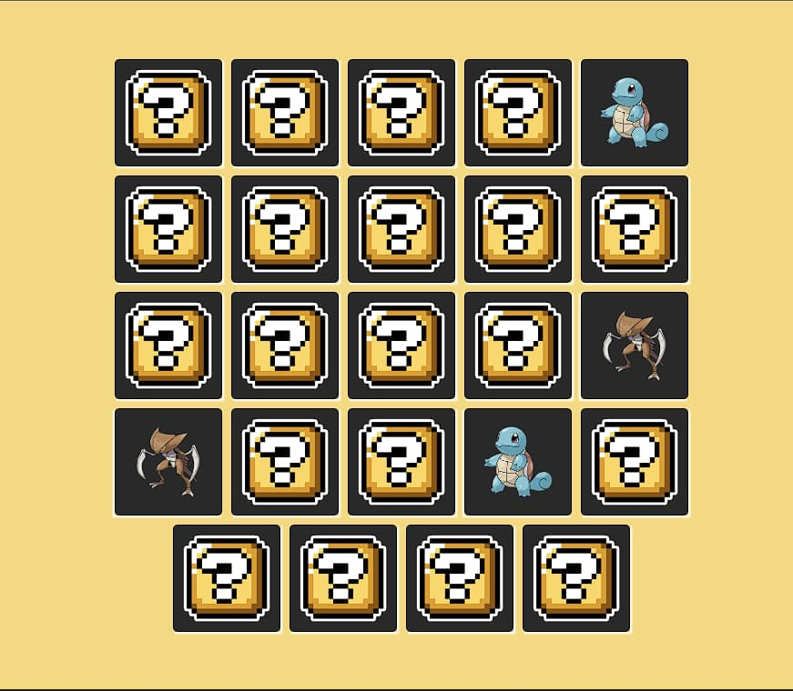

<h1 align="center"> Poke memory </h1>

Jogo da memória com o tema pokémon.  

  <a href="#-tecnologias">Tecnologias</a>&nbsp;&nbsp;&nbsp;|&nbsp;&nbsp;&nbsp;
  <a href="#-projeto">Projeto</a>&nbsp;&nbsp;&nbsp;|&nbsp;&nbsp;&nbsp;
  <a href="#memo-licença">Licença</a>

  

 

  

## 🚀 Tecnologias

Esse projeto foi desenvolvido com as seguintes tecnologias:

- HTML e CSS
- JavaScript
- Git e Github

## 💻 Projeto

Desenvolvido através de um bootcamp da DIO, foram adicionados mais cards e personalizado com tema pokémon.

- [Acesse o projeto finalizado, online](https://gabtech1.github.io/Jogo_memoria_DIO/)

## :memo: Licença

Esse projeto está sob a licença MIT.

---

Divirta-se 🎮